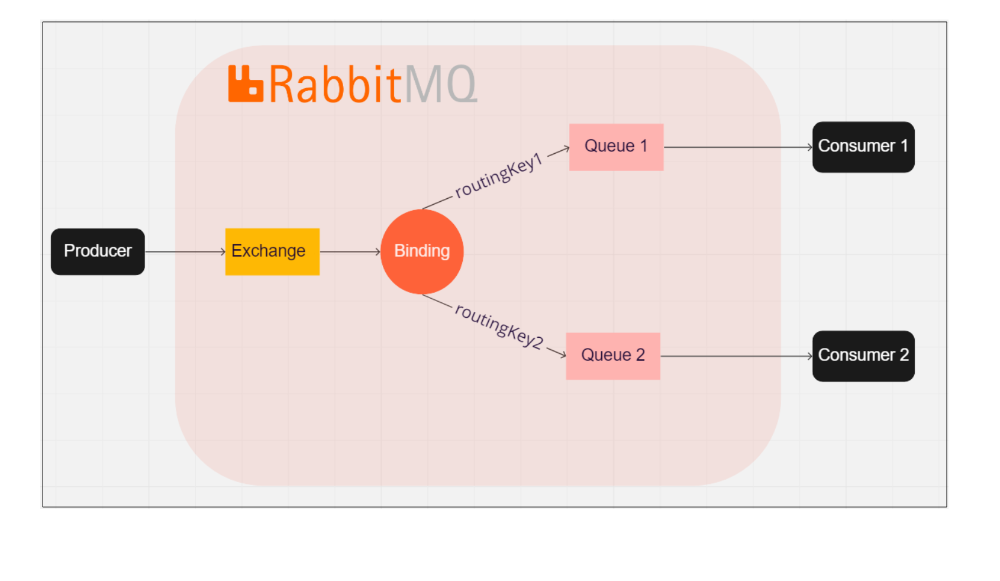
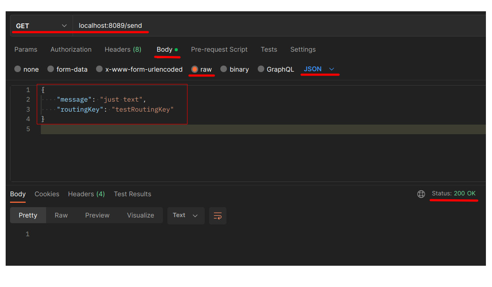

# Info
- Новый пример работы с брокером сообщений **RabbitMQ** на **Spring**
- Используется библиотека **Spring AMQP** запущенная в **Docker**
- Отправляем сообщения через **Producer**, получаем - через **Consumer**

# Подготовить окружение для работы
1. **Установить RabbitMQ с помощью Docker**:

Файл `docker-compose.yaml` имеет вид:  
  

Запускаем командой:  
`docker-compose up --build -d`  

Далее открываем в браузере адрес http://localhost:15672/ и вводим:  
- Username: `rabbit1`    
- Password: `pswd1`    

В итоге попадаем в вэб-интерфейс RabbitMQ.

2. Схема работы RabbitMQ:  

Общая схема взаимодействия выглядит следующим образом:    
  

- **Producer** - производитель сообщений (отдельное приложение на Java).
- **Consumer 1**, **Consumer 2** - потребители сообщений (отдельные приложения).
- **Exchange** - обменник. Cущность Rabbit, точка входа для публикации всех сообщений.
- **Binding** - связь между Exchange и очередью.
- **Queue** - очередь сообщений.

Все сообщения из приложения Producer попадают в Exchange, после этого обрабатываются
на основе **Binding** и **routingKey**. После этого сообщения попадают в Очередь
и забираются из неё Consumer-ом.

3. Создать virtual host:
   
В процессе работы может фигурировать такая сущность, как **virtual host**. Создадим его (потому что
в продакшене точно не будет использоваться дефолтный). Заходим в **Admin**, справа выбираем  
**Virtual Hosts** и создаём новый, через кнопку **Add virtual host**. Назовём его **cpp**:  

   
4. Создать Exchange:

**Exchanges** -> **Add a new exchange** -> указываем такие параметры:  
- Virtual host: `cpp`  
- Name: `testExchange`  
- Type: `direct`  

5. Создать очередь (Queue):

**Queues** -> **Add a new queue** -> указываем параметры:  
- Virtual host: `cpp`  
- Name: `queue1`  

6. Задать Binding:

Остался последний шаг для настройки окружения. Теперь зададим **Binding**. Он нужен для того, чтобы данные,
которые попадают в Exchange (а туда попадают все сообщения из Producer-a) распределялись по разным очередям
(разные Bingings будут распределять сообщения в разные очереди). Для того, чтобы создать Binding заходим
в нашу созданную очередь **queue1** и во вкладке **Bindings** добавляем новый Binging:    

Теперь все сообщения, которые попадают в наш Exchange (который называется **testExchange**) и имеют 
**routingKey** с названием **testRoutingKey**, будут попадать в очередь **queue1**.

# Модуль consumer
Создадим 2 простейших приложения на **Java 11** (**consumer** на порту `8088`, и **producer** на порту `8089`).  
Будем использовать **Spring Boot**. Зависимости: **Spring AMQP**, **Spring Web**, **Lombok**.

В **модуле consumer** создадим пакеты config и component. В пакете config будет класс RabbitConfig,
а в пакете component - класс RabbitMQConsumer:  

# Модуль producer
В **модуле producer** создадим 4 пакета: config, controller, model, service.
В пакете config будет класс RabbitConfig, в пакете controller - класс RabbitController,
в пакете model - класс MessageModel, в пакете service - интерфейс RabbitMQProducerService
и его имплементация RabbitMQProducerServiceImpl:  

# Тестирование работоспособности
Сначала запускаем только **Producer**. Отправляем запрос через _Postman_:    

Делаем 3 запроса подряд в _Postman-е_. Затем смотрим нашу очередь **queue1** и видим,  
что все 3 сообщения находятся в ней:  

Затем запускаем **Consumer** и видим, что он забрал все сообщения из очереди **queue1**:  

Но если мы передадим в нашем запросе к **Producer-у**  
`"routingKey": отличный от значения "testRoutingKey"`  
то наш **Consumer** не получит это сообщение из Очереди, поскольку он получает
только сообщения с `routingKey = testRoutingKey`

# Использованные источники
- [Статья](https://habr.com/ru/post/703352/) на Хабре
