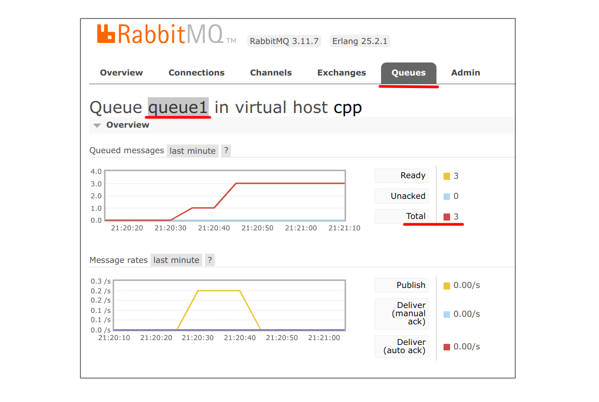
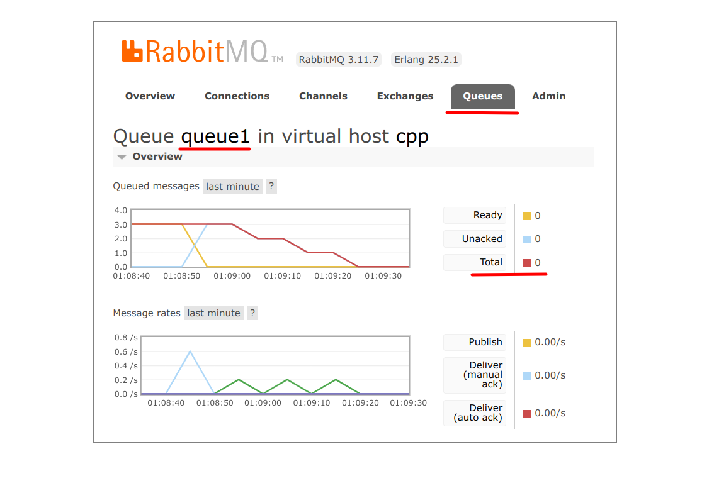

# Info:
- Проект **название**.
- Используем RabbitMQ + Spring boot + Docker
- Отправляем и получаем сообщения через Producer и Consumer
- Пишем свой spring boot сервис с подключением к нему rabbitMQ

# Подготовим наше окружение для работы
1. Установить RabbitMQ с помощью Docker

Файл docker-compose.yaml имеет вид:  

Запускаем командой:  
docker-compose up --build -d

Открыть в браузере  
http://localhost:15672/

Ввести  
- Username: rabbit1  
- Password: pswd1  

Попадаем в веб-интерфейс RabbitMQ

2. Схема работы RabbitMQ
Общая схема взаимодействия выглядит следующим образом:  
   

Producer - производитель сообщений (отдельное приложение на Java)
Consumer 1, Consumer 2 - потребители сообщений (отдельные приложения)
Exchange - обменник. Cущность Rabbit, точка входа для публикации всех сообщений.
Binding - связь между Exchange и очередью
Queue - очередь сообщений

Все сообщения из приложения Producer попадают в Exchange, после этого обрабатываются
на основе binding и routingKey, после сообщение попадает в очередь и забирается из неё consumer-ом.

3. Создать virtual host
   В процессе работы может фигурировать такая сущность, как virtual host, создадим его (потому что
   в продакшене точно не будет использоваться дефолтный). Заходим в **Admin**, справа выбираем **Virtual Hosts**
   и создаём новый, через кнопку **Add virtual host**. Назовём его **cpp**:
   
   
4. Создать Exchange

**Exchanges** -> **Add a new exchange** -> указываем такие параметры:  
Virtual host: cpp  
Name: testExchange  
Type: direct  

5. Создать очередь (Queue)

**Queues** -> **Add a new queue** -> указываем параметры:  
Virtual host: cpp  
Name: queue1  

6. Задать Binding

Остался последний шаг, для настройки окружения. Теперь зададим Binding. Он нужен для того, чтобы данные,
которые попадают в Exchange (а туда попадают все сообщения из Producer-a) распределялись по разным очередям
(разные Bingings будут распределять сообщения в разные очереди). Для того, что бы создать Binding заходим
в нашу созданную очередь **queue1** и во вкладке **Bindings** добавляем новый binging:  

Теперь все сообщения, которые попадают в наш Exchange (который называется **testExchange**) и имеют 
**routingKey** с названием **testRoutingKey**, будут попадать в очередь **queue1**.

# Модуль consumer
Создадим 2 простейших приложения на Java 11 (**consumer** на порту 8088, и **producer** на порту 8089).
Будем использовать Spring Boot. Зависимости: **Spring AMQP**, **Spring Web**, **Lombok**.

В **модуле consumer** создадим пакеты config и component. В пакете config будет класс RabbitConfig,
а в пакете component - класс RabbitMQConsumer

# Модуль producer
В **модуле producer** создадим 4 пакета: config, controller, model, service.
В пакете config будет класс RabbitConfig, в пакете controller - класс RabbitController,
в пакете model - класс MessageModel, в пакете service - интерфейс RabbitMQProducerService
и его имплементация RabbitMQProducerServiceImpl.

# Тестирование работоспособности
Сначала запускаем только Producer. Отправляем запрос через Postman:  

Делаем 3 запроса подряд в Postman. Затем смотрим нашу очередь **queue1** и видим,
что все 3 сообщения находятся в ней:  

Затем запускаем Consumer и видим, что он получил все сообщения из очереди **queue1**:  

Но если мы передадим в нашем запросе к Producer-у
`"routingKey": отличный от значения "testRoutingKey"`, то наш Consumer не получит
это сообщение из очереди, поскольку он получает только сообщения с routingKey = testRoutingKey

# Источники

Статья на Хабре https://habr.com/ru/post/703352/
